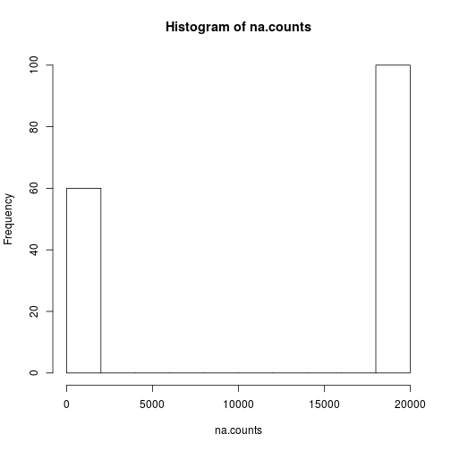
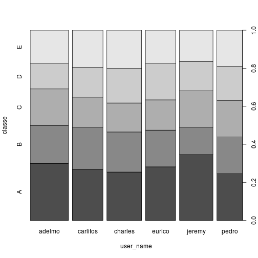
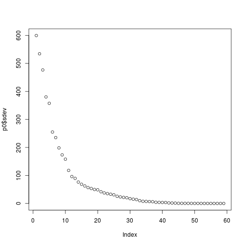

# Prediction Assignment Writeup

## Introduction

Six participants fitted with wearable sensors performed 10 sets of bicep curls in five different fashions (exercise classes `A` through `E`). The goal of this project is to construct and evaluate a machine learning model to predict which exercise classes was performed for given observations, using sensor readings as predictors.

Reference: [Human Activity Recognition, Weight-Lifting Exercises](http://groupware.les.inf.puc-rio.br/har#weight_lifting_exercises#ixzz4TjKsbTNc):  
Velloso, E.; Bulling, A.; Gellersen, H.; Ugulino, W.; Fuks, H. Qualitative Activity Recognition of Weight Lifting Exercises. Proceedings of 4th International Conference in Cooperation with SIGCHI (Augmented Human '13) . Stuttgart, Germany: ACM SIGCHI, 2013.

## Setup and Input

Libraries


```r
library(caret)
```

Load Data


```r
training <- read.csv("pml-training.csv",na.strings=c("NA","","#DIV/0!"))
dim(training)
```

```
## [1] 19622   160
```

```r
testing <- read.csv("pml-testing.csv",na.strings=c("NA","","#DIV/0!"))
dim(testing)
```

```
## [1]  20 160
```

## Tidy the Data

There are 60 variables in the training set with no missing values. The other 100 variables each have more than 19000 missing values; drop these from training and test sets.


```r
na.counts <- colSums(is.na(training))
table(na.counts)
```

```
## na.counts
##     0 19216 19217 19218 19220 19221 19225 19226 19227 19248 19293 19294 
##    60    67     1     1     1     4     1     4     2     2     1     1 
## 19296 19299 19300 19301 19622 
##     2     1     4     2     6
```

```r
hist(na.counts)
```



```r
training.no.na <- training[na.counts == 0]
dim(training.no.na)
```

```
## [1] 19622    60
```

```r
testing.no.na <- testing[na.counts == 0]
dim(testing.no.na)
```

```
## [1] 20 60
```

Drop more variables

- drop column 1, it is row number in the csv file, no predictive value
- drop timestamps (columns 3-5), see if we can get by without using them
- drop new_window (column 6) logical variable which is mostly `no` in training


```r
table(training$new_window)
```

```
## 
##    no   yes 
## 19216   406
```

```r
train.noX <- training.no.na[c(-1, -3, -4, -5, -6)]
dim(train.noX)
```

```
## [1] 19622    55
```

```r
test.noX <- testing.no.na[c(-1, -3, -4, -5, -6)]
dim(test.noX)
```

```
## [1] 20 55
```
## Explore and Preprocess Data

Variable `user_name` (column 1) appears to be significant. (Note that taking `user_name` as predictor implies the model will require calibrating to each new user.)


```r
table(training$user_name)
```

```
## 
##   adelmo carlitos  charles   eurico   jeremy    pedro 
##     3892     3112     3536     3070     3402     2610
```

```r
plot(training[,c("user_name","classe")])
```



Convert factor `user_name` to 6 numeric variables (dummy variables) to allow `gbm` modeling.


```r
dv <- dummyVars(~ user_name,data=test.noX)
train.dv <- cbind(predict(dv,newdata=train.noX),train.noX[,-1])
dim(train.dv)
```

```
## [1] 19622    60
```

```r
test.dv <- cbind(predict(dv,newdata=test.noX),test.noX[,-1])
dim(test.dv)
```

```
## [1] 20 60
```
Check for near-zero covariance to see if we can drop more variables. No, there are not any variables with zero variance or near-zero variance.

```r
nzc <- nearZeroVar(train.dv, saveMetrics = T)
table(nzc$nzv)
```

```
## 
## FALSE 
##    60
```

```r
table(nzc$zeroVar)
```

```
## 
## FALSE 
##    60
```
Compute principal component analysis to see if some of the variables can be dropped. Gradual fall-off of curve suggests we can't reduce number of variables significantly by dropping low-importance variables, so won't use PCA for the model.

```r
p0 <- prcomp(subset(train.dv, select = -c(classe)))
plot(p0$sdev)
```



Subset the training set to reduce model run time. Use 1/10 of original training set.

```r
set.seed(107)
inTr <- createDataPartition(y=train.dv$classe,p=0.1,list=F)
train.dv.subset <- train.dv[inTr,]
dim(train.dv.subset)
```

```
## [1] 1964   60
```

## Buid and Evaluate the Model

Each section addresses one of the 4 parts of the project assignment.

### 1. How the Model is Built

Because outcome is a nominal variable, use gradient-boosting multinomial logistic regression (`gbm`) with k-fold cross-validation. Report on run-time of the model on the training subset used.


```r
t1 <- Sys.time()
train_control<- trainControl(method="cv", number=10, savePredictions = TRUE)
mod1 <- train(classe ~ ., data=train.dv.subset, trControl=train_control, method="gbm", verbose=F)
```

```
## Loading required package: gbm
```

```
## Loading required package: survival
```

```
## 
## Attaching package: 'survival'
```

```
## The following object is masked from 'package:caret':
## 
##     cluster
```

```
## Loading required package: splines
```

```
## Loading required package: parallel
```

```
## Loaded gbm 2.1
```

```
## Loading required package: plyr
```

```r
Sys.time() - t1
```

```
## Time difference of 1.46186 mins
```
Compute confusion matrix for training subset.


```r
confusionMatrix.train(mod1)
```

```
## Cross-Validated (10 fold) Confusion Matrix 
## 
## (entries are percentual average cell counts across resamples)
##  
##           Reference
## Prediction    A    B    C    D    E
##          A 27.9  0.7  0.0  0.1  0.0
##          B  0.4 17.9  0.5  0.2  0.4
##          C  0.1  0.6 16.8  0.7  0.3
##          D  0.1  0.1  0.2 15.2  0.4
##          E  0.1  0.1  0.0  0.3 17.4
##                             
##  Accuracy (average) : 0.9506
```
Compute confusion matrix obtained by applying model to entire training set.

```r
confusionMatrix(train.dv$classe,predict(mod1,newdata=train.dv))$table
```

```
##           Reference
## Prediction    A    B    C    D    E
##          A 5516   27    1   19   17
##          B  132 3515   85   46   19
##          C    0  109 3276   32    5
##          D    0   13  160 3027   16
##          E    7   59   51   40 3450
```

```r
confusionMatrix(train.dv$classe,predict(mod1,newdata=train.dv))$overall[1]
```

```
##  Accuracy 
## 0.9572928
```

### 2. How Cross-Validation Is Used

K-fold cross-validation is used with k = 10.

### 3. Expected Out-of-Sample Error

Because 9/10 of training set was not used to build the model, use it to estimate out-of-sample error.

```r
train.oos.subset <- train.dv[-inTr,]
dim(train.oos.subset)
```

```
## [1] 17658    60
```

```r
cm.oos <- confusionMatrix(train.oos.subset$classe,
                          predict(mod1,newdata=train.oos.subset))
cm.oos$overall[1]
```

```
## Accuracy 
## 0.952656
```

```r
print(paste('expected out of sample error', as.numeric(1 - cm.oos$overall[1])))
```

```
## [1] "expected out of sample error 0.0473439800656926"
```

### 4. Why I Made the Choices I Did

- A subset of the initial training set was used to build the model because
    - build time with the full training set was > 20 minutes
    - 10% subset gave sufficient accuracy
- Gradient-boosting multinomial logistic regression (`gbm`) was used because outcome is a nominal variable and most predictors take on continuous values.
- K-fold cross-validation with value of 10 for k because that value is efficient for 60 predictors; leave-one-out cross-validation would have been too slow.

## Predict Test Set Outcomes

Here are the predictions provided by the above model for the 20 observations in the test set.

```r
predict(mod1,newdata=test.dv)
```

```
##  [1] B A B A A E D B A A B C B A E E A B B B
## Levels: A B C D E
```

## Conclusion

Expected accuracy near 95% is obtained modeling the given data using gradient-boosted multinomial logistic regression with 10-fold cross-validation.
